# Manual do revendedor

Para os revendedores que usam o dashboard em `https://<dominio>/painel`. As telas abaixo estão
em [`screens/web/`](screens/web/) (capturadas no ambiente de desenvolvimento; o nome da
plataforma e as cores podem ser diferentes na sua instalação).

## 1. Entrar

Use o usuário e a senha que o administrador enviou. Depois, troque a senha em **Perfil**
(§7). O painel tem tema claro e escuro (ícone no topo); a escolha fica salva no navegador.

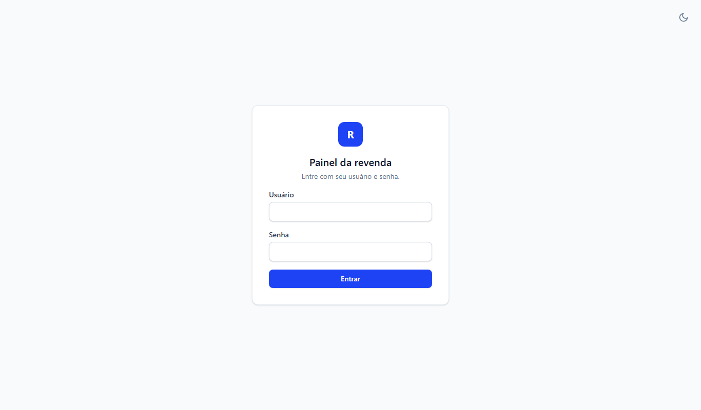

No topo você vê o **vencimento** da sua conta e, se a plataforma usar créditos, o **saldo**.
Com a conta vencida, só as telas *Renovar* e *Perfil* continuam acessíveis e os apps dos
seus clientes mostram "Expirado" até você renovar (§6).

## 2. Cadastrar um dispositivo (cliente)

Cada cliente instala o app na TV ou no celular (`https://<dominio>/downloads/app.apk`, ver
[`MANUAL-APP.md`](MANUAL-APP.md)). Ao abrir, o app mostra um **MAC** no formato
`02:50:50:XX:XX:XX`. Peça esse código ao cliente (no celular ele pode tocar em **Copiar MAC**
ou **Compartilhar**).

**Dispositivos → Novo dispositivo**:

| Campo | Preencher com |
|---|---|
| **MAC** | O código exibido pelo app (com ou sem os dois-pontos) |
| **Nome do cliente** | Como você quer identificar (ex.: "João — sala") |
| **Nome da playlist** | Um rótulo (ex.: "Lista principal") |
| **URL da playlist** | O endereço completo do seu servidor. Xtream: `http://servidor:porta/get.php?username=USUARIO&password=SENHA&type=m3u_plus&output=ts`. M3U: o link direto da lista |
| **Vencimento** | Data até quando o cliente pode assistir (padrão: sem limite prático) |

Ao salvar, se a plataforma usar créditos, **1 crédito** é debitado. O cliente toca em
**"Já cadastrei — verificar"** no app e a lista carrega sozinha.

Mensagens possíveis: *"Este MAC já está cadastrado na sua conta"* (você já cadastrou esse
aparelho) e *"Este MAC já pertence a outro revendedor"* (o cliente veio de outra revenda; ele
precisa pedir a exclusão lá antes).

## 3. Gerenciar dispositivos

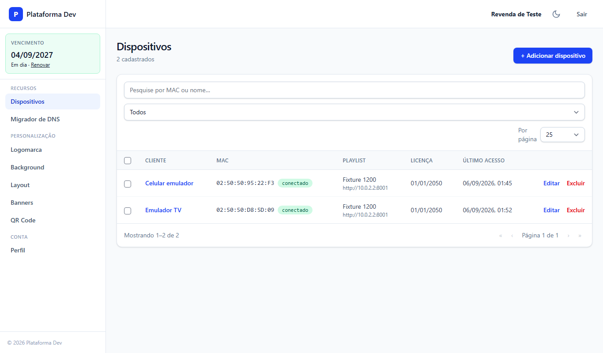

- **Busca** por MAC ou nome; filtro por *ativos* e *vencidos*; paginação.
- **Conectado**: o aparelho já abriu o app (o MAC foi gerado pelo app). *Não conectado*
  significa que você cadastrou o MAC antes de o app ser aberto ou digitou errado.
- **Última vez visto**: quando o app buscou a configuração pela última vez.
- Clique no dispositivo para **editar** nome, playlist e vencimento. Trocar a URL da
  playlist vale para o cliente na próxima atualização do app (até 6 h, ou na hora se ele usar
  *Configurações → Atualizar listas*).

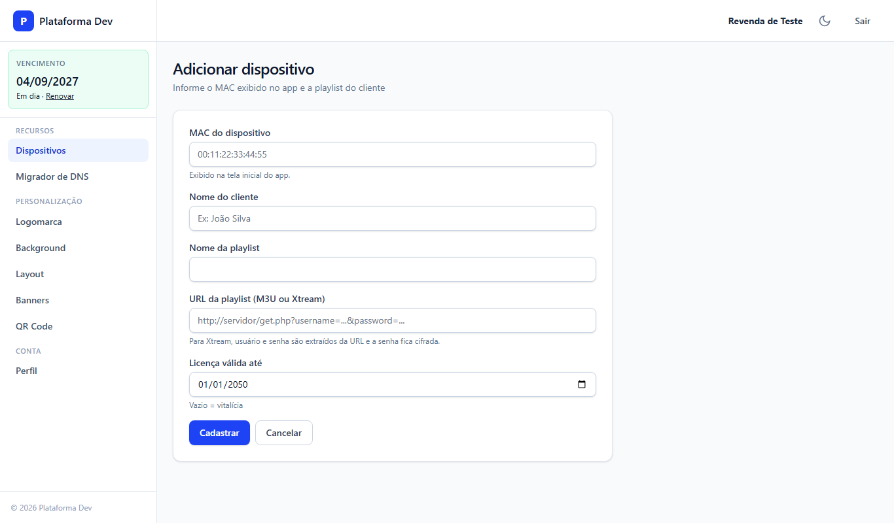

- **Excluir** (um por vez ou selecionando vários e usando *Excluir selecionados*): o app do
  cliente volta para a tela de ativação. Créditos gastos **não** são devolvidos.

## 4. Migrador de DNS

Quando o endereço do seu servidor muda (novo domínio ou porta), não é preciso editar
dispositivo por dispositivo.

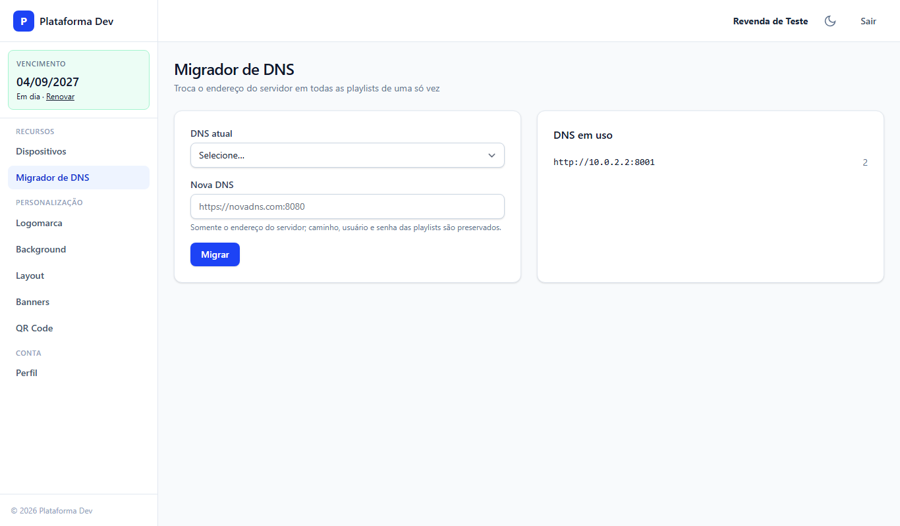

1. A tela lista os **hosts em uso** nas suas playlists e quantas playlists usam cada um.
2. Informe a **DNS atual** e a **nova** (ex.: `http://antigo.com:8080` → `http://novo.com:8080`).
3. Confirme. Todas as playlists com o host antigo passam para o novo, mantendo usuário,
   senha e o restante do link. A migração fica registrada na auditoria da plataforma.

Os apps recebem o novo endereço na próxima atualização automática (ou imediatamente com
*Atualizar listas*).

## 5. Personalização do app (white label)

Tudo o que você configurar aqui aparece no app de **todos os seus clientes** na próxima
abertura.

| Tela | O que faz |
|---|---|
| **Logomarca** 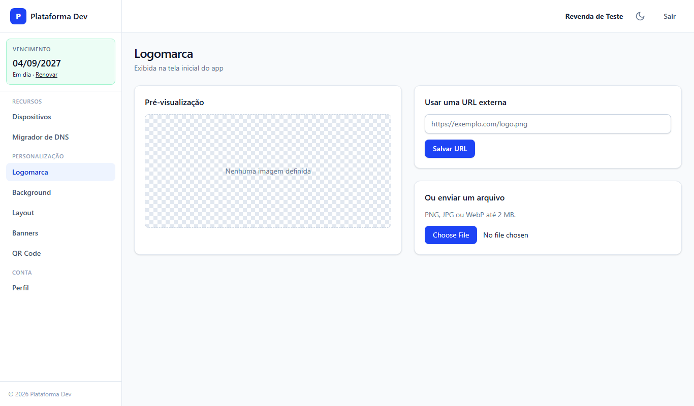 | Envie PNG/JPG/WebP de até 2 MB (fundo transparente fica melhor). Aparece na tela inicial do app |
| **Background** 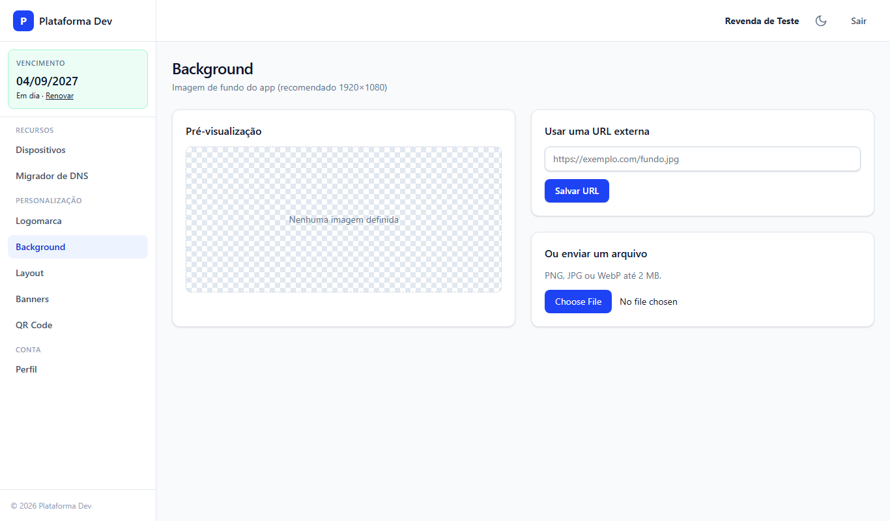 | Imagem de fundo da tela inicial (recomendado 1920×1080) |
| **QR Code** 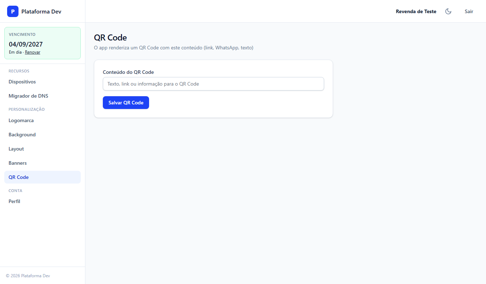 | Conteúdo do QR mostrado no app (link do seu WhatsApp, site ou texto). O cliente aponta a câmera para falar com você |
| **Banners** 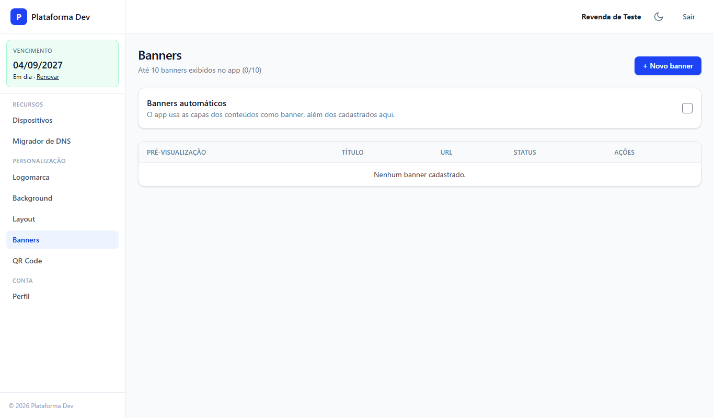 | Até 10 imagens por URL (hospedadas por você). Ative/desative cada uma; só as ativas aparecem no app, em rodízio |
| **Layout** 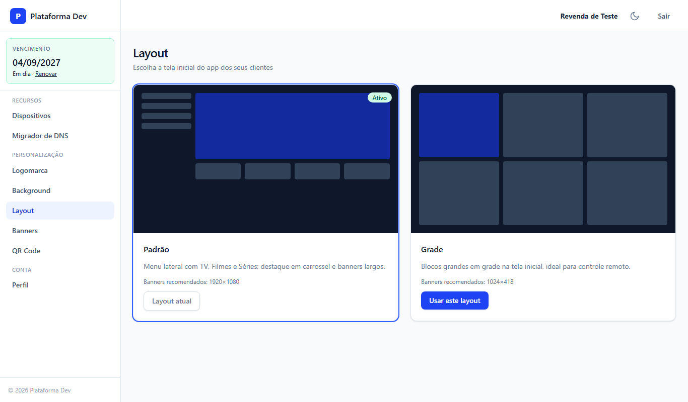 | Escolha entre os 2 layouts da tela inicial (menu lateral com destaques ou grade de blocos) |

## 6. Renovar (Pix)

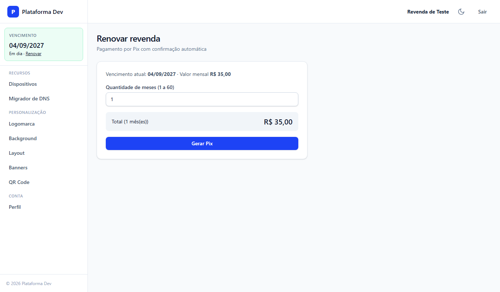

1. Escolha **1 mês** (preço mensal) ou um **pacote** com desconto.
2. Clique em **Gerar Pix**: aparecem o QR Code e o código **copia e cola**, válidos por 30 minutos.
3. Pague no app do seu banco. A confirmação chega sozinha (a tela atualiza) e o seu
   **vencimento é estendido** a partir da data atual de vencimento — renovar antes de vencer
   não faz você perder dias.
4. O histórico fica na própria tela. Se o pagamento constar como pago no banco mas continuar
   *pendente* aqui, reabra a tela *Renovar* (ela consulta o gateway); persistindo, fale com o
   administrador informando a data e o valor.

Se a plataforma usar **créditos**, a compra de créditos é combinada diretamente com o
administrador, que lança o saldo na sua conta.

## 7. Perfil

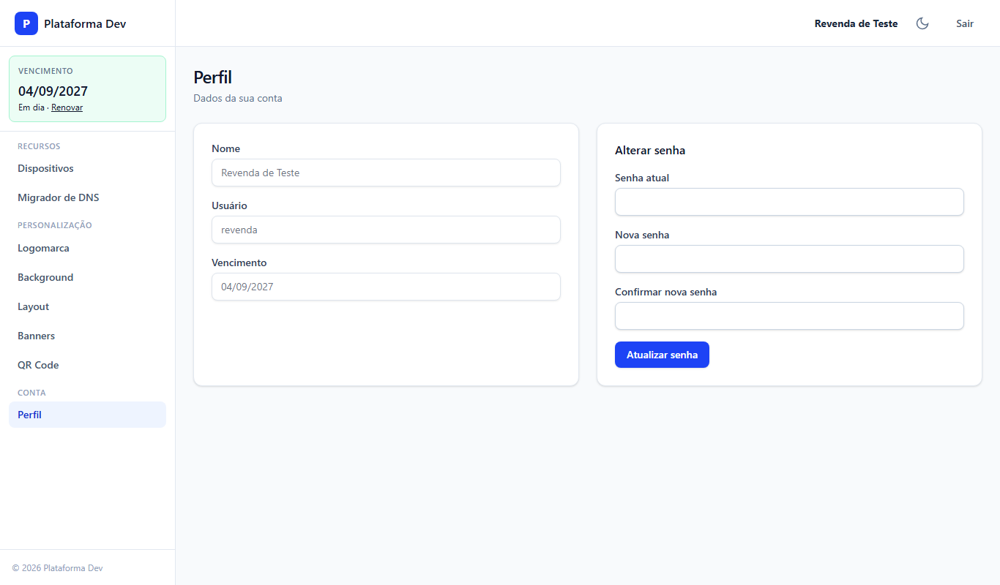

Troque a sua senha informando a atual. Use uma senha própria, com pelo menos 6 caracteres.
Se esquecer, peça ao administrador para redefinir.

## 8. Dúvidas frequentes

| Pergunta | Resposta |
|---|---|
| O cliente vê "Dispositivo não cadastrado" | Confira o MAC (letras O × zero, B × 8) e se o cadastro foi salvo. Peça para tocar em *Já cadastrei — verificar* de novo |
| O cliente vê "Expirado" | Ou o vencimento **dele** passou (edite o dispositivo) ou o **seu** passou (renove) |
| Troquei a playlist e o app continua com a antiga | O app atualiza a cada 6 h; peça ao cliente para usar *Configurações → Atualizar listas* |
| Posso cadastrar mais de uma playlist no mesmo aparelho? | Pelo painel, uma; o cliente pode adicionar outras dentro do app (*Configurações → Trocar playlist → Adicionar*) |
| Perdi um aparelho para outro revendedor? | Um MAC só pertence a uma revenda por vez. Se você excluir o dispositivo, outra revenda pode cadastrá-lo |
